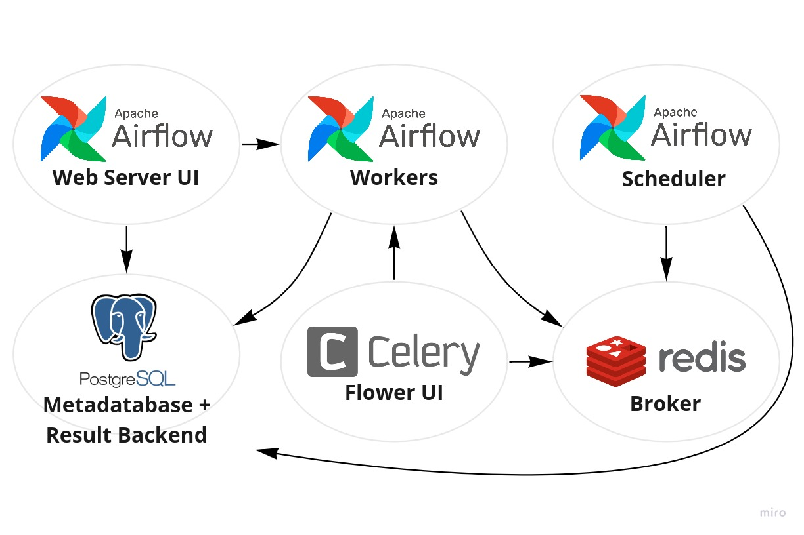

# Airflow Celery Workers

<p>


</p>

This repo contains a setup to config Airflow 2.0 with Celery workers. To do it, two databases (Postgres and Redis) are setup: a Postgres container to serve as a metadatabase; and Redis as the broker database and connection between the scheduler and workers. Besides the two database and worker containers, the scheduler and other two UIs are also setup with docker: Airflow Webserver (by default, at port 8080) and Airflow Celery Flower (by default, at port 5555). The following diagram represents the infrasctructure builded:

<p align="center"></p>

## How to use

Locally, just build up the docker containers and set the desired number of workers. The following code example set 4 celery workers:

```shell
docker-compose up --detach --scale worker=4
```

To build up only one worker, you can run the following command:

```shell
docker-compose up --detach
```

By default, you can access the Airflow Webserver UI in `http://localhost:8080` and the Airflow Flower UI in `http://localhost:5555/flower/`. In GCP virtual machines, you will need setup a proxy like Nginx to redirect the addresses to the ports 80 or 443 and then get access to the UI by the external IP. By running `install_dependencies.sh` and `proxy_config.sh` scripts, the dependencies like Docker, Nginx, StackDriver Agent and proxy configs are setted with the external IP of the virtual machine as the following sequence of commands:

```shell
sudo bash config/install_dependencies.sh
sudo docker-compose up --detach --scale worker=4
sudo bash config/proxy_config.sh $(curl -s http://whatismyip.akamai.com/) config/proxy
```

So, if your VM has an external IP like `123.456.789.101` you will get access to the UIs in `http://123.456.789.101` and `http://123.456.789.101/flower/`. Don't forget to enable the http access in the machine settings. By default, the UIs can be accessed with login `admin` and password `admin`. You can can set better credentials in the `docker-compose.yaml` file in `x-default-user` section.

To configure the workers in different machines from scheduler and web UIs, get up a VM and run the app config scripts normally. Then, build up the scheduler, UIs and databases containers as this (without worker containers):

```shell
sudo bash config/install_dependencies.sh
docker-compose up --detach webserver flower
sudo bash config/proxy_config.sh $(curl -s http://whatismyip.akamai.com/) config/proxy
```

To setup the workers, get up the worker VMs and install their dependencies as the app configuration. Configure the connections to reach the database addresses with their internal IPs: if the database host internal IP was `10.128.0.100`, you need to replace it in postgres and redis connections like `redis://10.128.0.100:6379/1`. After this, build up the worker container:

```shell
sudo bash config/install_dependencies.sh
docker-compose up --detach worker
```


